# 🎨 Frontend Testing

This section documents the **Smoke Test** for the frontend module.
It identifies the most critical UI flows that must be validated after each deployment to ensure the system remains functional and stable.

---

## 🚀 Smoke Test — Critical Flows

| ID       | Flow Tested                                  | Why It's Critical                                                                                                                               | Test Cases                                           | Implemented   |
| -------- | -------------------------------------------- | ----------------------------------------------------------------------------------------------------------------------------------------------- | ---------------------------------------------------- | ------------- |
| **F-01** | **Price Consultation - Search Input**        | Allows users to enter product name to search. First interaction point for price consultation. Without this, users cannot initiate queries.      | Enter product name in search input                   | ✅ Implemented |
| **F-01** | **Price Consultation - Market Filter**       | Enables filtering by specific market (plaza). Essential for location-specific pricing, which varies significantly across markets.               | Select market from "Filter by markets" dropdown      | ✅ Implemented |
| **F-01** | **Price Consultation - Display Results**     | Shows complete price information including current price, variation, average price, trend, and historical chart. Core value proposition.        | Click "Search prices" and view results page          | ✅ Implemented |
| **F-01** | **Price Consultation - Period Selection**    | Allows viewing price history for different time periods (3, 6, 12 months). Critical for understanding price trends and patterns.                | Switch between 3, 6, and 12 month period buttons     | ✅ Implemented |
| **F-01** | **Price Consultation - Handle No Data**      | Displays clear error message (404) when product has no historical data. Prevents crashes and provides user feedback with retry option.          | Search for product with no data                      | ✅ Implemented |
| **F-06** | **User Login - Incomplete Email Validation** | Prevents users from attempting authentication with invalid emails. Client-side validation improves UX before calling the API.                   | Email without complete domain (`arigato@`)           | ✅ Implemented |
| **F-06** | **User Login - Invalid Email Validation**    | Ensures only properly formatted emails are sent to the backend, reducing unnecessary failed requests.                                           | Email with invalid domain (`arigato@asdwdqwqeq.com`) | ✅ Implemented |
| **F-06** | **User Login - Incorrect Credentials**       | Displays clear messages when credentials don't match system records.                                                                            | Valid email with incorrect password                  | ✅ Implemented |
| **F-06** | **User Login - Empty Fields Validation**     | Guarantees both fields (email and password) are completed before attempting login.                                                              | Form submission with empty fields                    | ✅ Implemented |
| **F-06** | **User Login - Successful Login**            | Main flow that allows authenticated users to access the system. It's the ultimate goal of the authentication process.                          | Valid email and password                             | ✅ Implemented |

---

## 🧪 Detailed Test Cases

### **F-01: Price Consultation - Search Input**

**Status**: ✅ Implemented

#### **What flow does it cover and why should it be part of the smoke test?**

This test validates that users can enter a product name in the search input field on the price consultation page. It's critical because:
- It's the **first interaction point** for the main feature of the application
- Without a functional search input, users cannot initiate any price consultation
- It validates basic UI rendering and user input handling
- Any failure here blocks the entire price consultation workflow

#### **How is it executed?**

**Manual Execution**:
1. Navigate to the price consultation page
2. Locate the search input field with placeholder "Buscar un producto"
3. Enter a product name (e.g., "Ajito", "Mayonesa Doy Pack", "Gelatina")
4. Verify the input accepts and displays the text correctly

#### **What type of test covers it?**

**Unit Test** - Because it validates:
- A single UI component (search input field)
- Basic user input functionality
- Visual rendering of the component
- No API calls or backend integration required

**Precondition**: User is on the price consultation page (home screen or main search page)

**Steps**:
1. Navigate to the price consultation page
2. Locate the search input field with placeholder "Buscar un producto" (Search a product)
3. Enter a product name in the search input (e.g., "Ajito", "Mayonesa Doy Pack", "Gelatina")
4. Observe the search functionality

**Expected Result**:
- ✅ Search input field is visible and accessible
- Input accepts text entry without errors
- User can type product names smoothly
- Search input maintains focus during typing
- System prepares to process the search query

**Reference Images**: 
  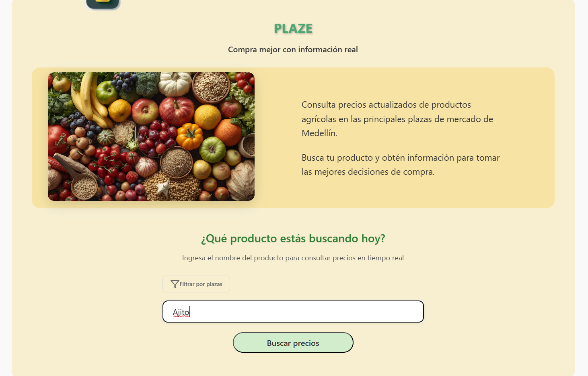 
  - Shows "Ajito" entered in search field
  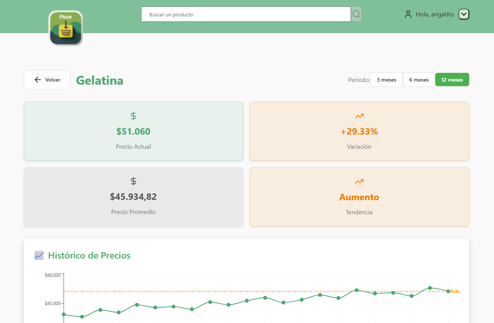 
  - Shows "Gelatina" being searched

---

### **F-01: Price Consultation - Market Filter**

**Status**: ✅ Implemented

#### **What flow does it cover and why should it be part of the smoke test?**

This test validates that users can filter products by specific market (plaza de mercado). It's critical because:
- Market-specific pricing is a **core differentiator** of the application
- Prices vary significantly between markets in the same city
- Without this filter, users cannot get location-specific price information
- It's essential for users to make informed purchasing decisions based on their location

#### **How is it executed?**

**Manual Execution**:
1. Enter a product name in the search field
2. Click on "Filtrar por plazas" button
3. Select a market from the dropdown (e.g., "Central Mayorista De Antioquia")
4. Verify the filter is applied and indicator shows "Filtrando por: [Market Name]"
5. Click "Buscar precios" to execute search with filter

#### **What type of test covers it?**

**Integration Test** - Because it involves:
- User interaction with dropdown component
- State management (selected market filter)
- UI updates based on filter selection
- Communication between search component and filter component
- Potential API call to get market-specific data

**Precondition**: 
- User is on the price consultation page
- A product has been entered in the search field

**Steps**:
1. Enter a product name in the search field (e.g., "Mayonesa Doy Pack")
2. Click on "Filtrar por plazas" (Filter by markets) button or link
3. View the market filter dropdown/modal that appears
4. Select a specific market from the dropdown (e.g., "Central Mayorista De Antioquia - Medellín")
5. Verify the filter is applied
6. Click "Buscar precios" (Search prices) button

**Expected Result**:
- ✅ "Filtrar por plazas" option is visible and clickable
- Dropdown displays available markets including "Todas las plazas de mercado" (All markets) option
- Selected market is highlighted in the filter section
- Filter indicator shows "Filtrando por: [Market Name]" below the product title
- System displays message "Buscando en: [Market Name]" when filter is active
- User can clear the filter with "Ocultar filtros" (Hide filters) or "Limpiar filtro" (Clear filter) options
- Search executes with the market filter applied

**Reference Images**:
  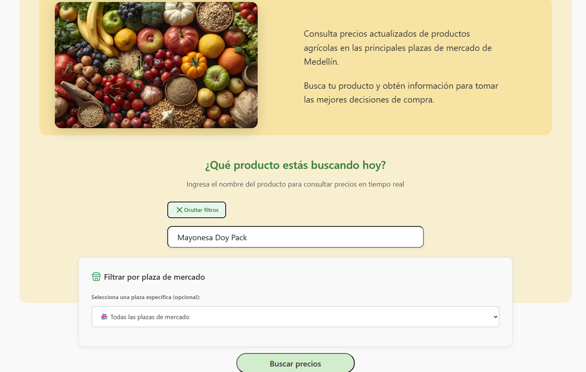 
  - Shows "Filtrar por plazas" button
  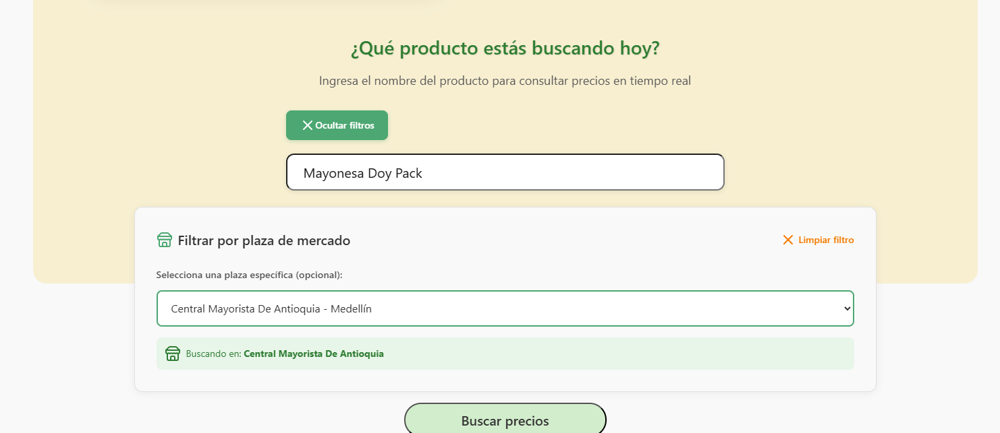 
  - Shows market dropdown with "Central Mayorista De Antioquia" selected
  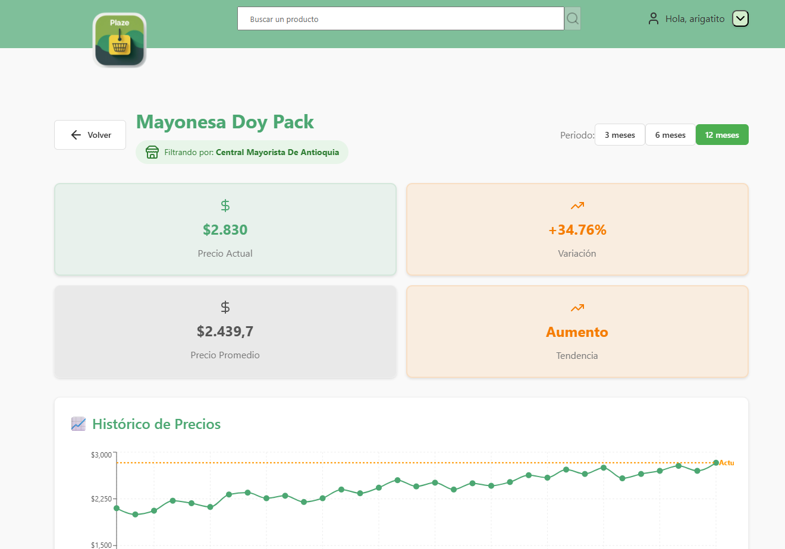 
  - Shows active filter indicator "Filtrando por: Central Mayorista De Antioquia"

---

### **F-01: Price Consultation - Display Results**

**Status**: ✅ Implemented

#### **What flow does it cover and why should it be part of the smoke test?**

This test validates the core functionality of displaying comprehensive price information for a selected product. It's critical because:
- This is the **main value proposition** of the entire application
- Users come to the app specifically to see current prices and trends
- Without this working, the application fails its primary purpose
- It involves multiple data points: current price, variation, average, trend, and historical chart
- Any failure here directly impacts user trust and app utility

#### **How is it executed?**

**Manual Execution**:
1. Enter a valid product name (e.g., "Ajo", "Mayonesa Doy Pack")
2. Optionally select a market filter
3. Click "Buscar precios" button
4. Wait for results page to load
5. Verify all price information cards and historical chart display correctly

#### **What type of test covers it?**

**Integration Test** (recommended) + **E2E Test** (desirable)

**Integration** because it involves:
- API call to fetch price data (`GET /api/prices/product/{name}`)
- Multiple component rendering (price cards, chart)
- Data formatting and calculation (averages, percentages, trends)
- State management for loaded data
- Error handling for failed requests

**E2E** to validate the complete user journey from search to results

**Precondition**: 
- User has entered a valid product name
- Optional: Market filter has been applied
- User has clicked "Buscar precios" button

**Steps**:
1. Enter product name (e.g., "Ajo", "Mayonesa Doy Pack", "Gelatina")
2. Optionally select a market filter
3. Click "Buscar precios" button
4. Wait for results page to load
5. Observe the displayed price information

**Expected Result**:
- ✅ Results page displays with product name as title
- Four main information cards are visible:
  1. **Current Price Card (Precio Actual)** - Shows current price with currency symbol (e.g., "$15.210")
  2. **Variation Card (Variación)** - Shows percentage change with arrow indicator (e.g., "+33.41%", "+10.18%", "+2.11%")
  3. **Average Price Card (Precio Promedio)** - Shows calculated average price (e.g., "$13.291,42")
  4. **Trend Card (Tendencia)** - Shows trend direction ("Aumento" for increase, "Estabilidad" for stable)
- Historical price chart titled "Histórico de Precios" is displayed below the cards
- Chart shows price evolution over time with data points and trend line
- Orange dotted line indicates "Actual" (current) price level
- "Volver" (Back) button is available for navigation
- If market filter was applied, indicator shows "Filtrando por: [Market Name]"

**Reference Images**:
- 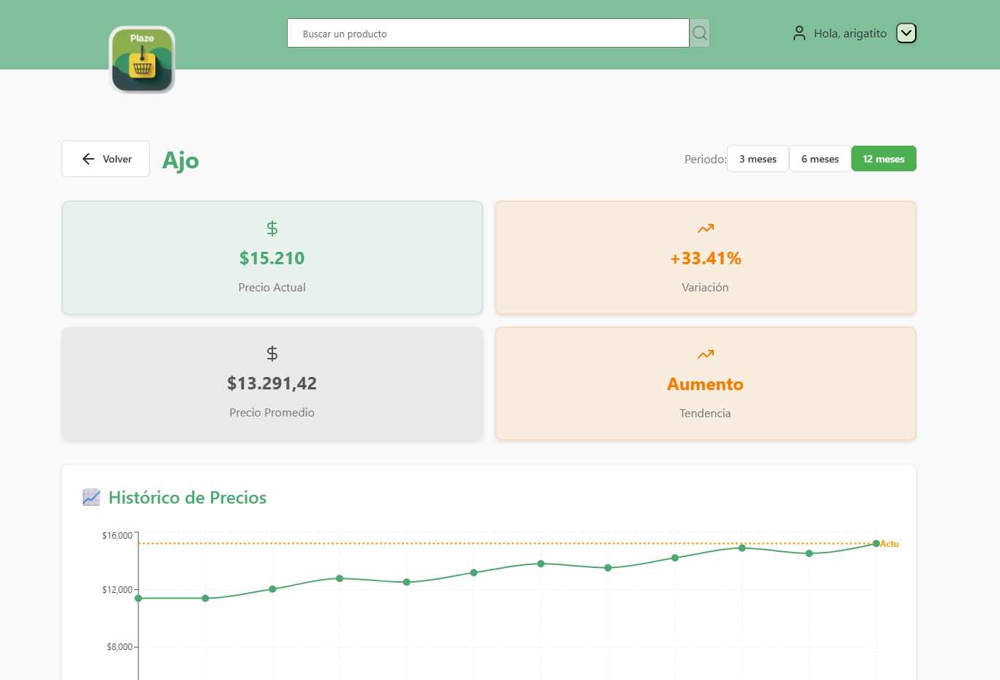 
  Shows "Ajo" with 12-month data, +33.41% variation, "Aumento" trend
- 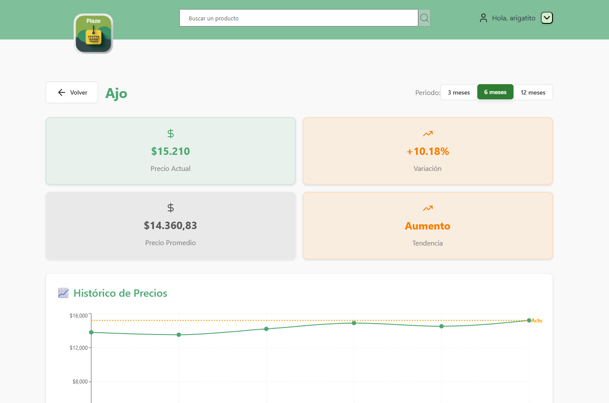 
  Shows "Ajo" with 6-month data, +10.18% variation, "Aumento" trend
- 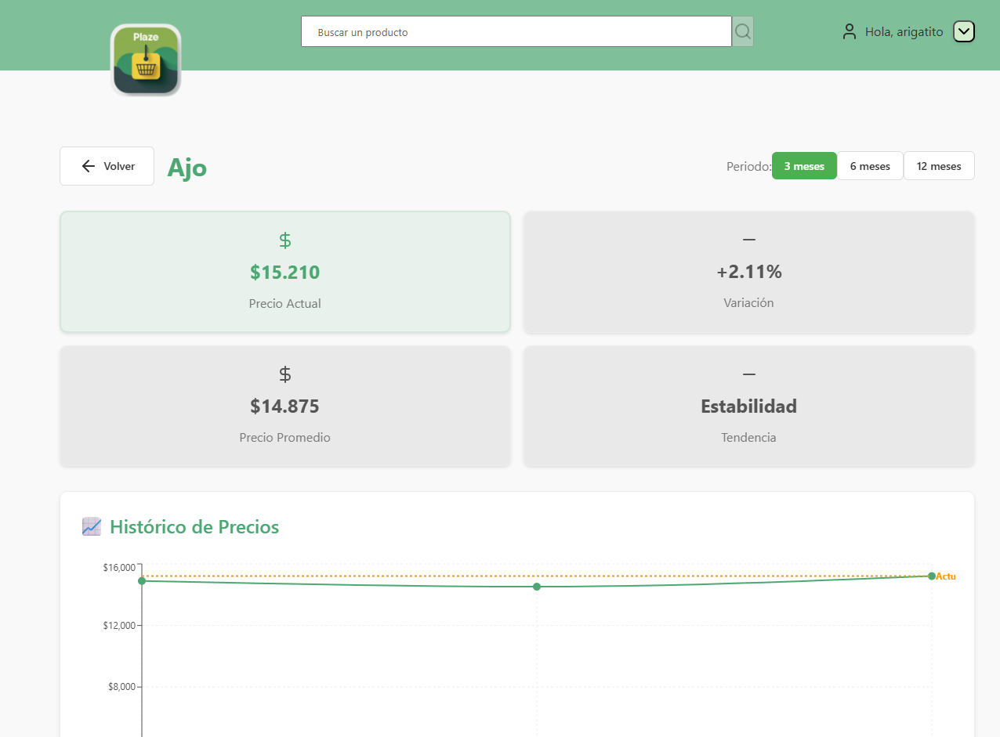 
  Shows "Ajo" with 3-month data, +2.11% variation, "Estabilidad" trend
-  
  Shows "Mayonesa Doy Pack" filtered by Central Mayorista, +34.76% variation
-  
  Shows "Gelatina" with +29.33% variation, "Aumento" trend

---

### **F-01: Price Consultation - Period Selection**

**Status**: ✅ Implemented

#### **What flow does it cover and why should it be part of the smoke test?**

This test validates that users can switch between different time periods (3, 6, 12 months) to view historical price data. It's critical because:
- Users need different time perspectives to understand **price trends and seasonality**
- Short-term vs long-term trends can inform different purchasing decisions
- It validates dynamic chart updates and data recalculation
- Without this, users only see one fixed time period, limiting the app's analytical value

#### **How is it executed?**

**Manual Execution**:
1. Navigate to a product's price details page
2. Locate the period buttons in the top-right (3 meses, 6 meses, 12 meses)
3. Click on each period button sequentially
4. Verify the chart and statistics update correctly for each period
5. Confirm variation percentages and trends change appropriately

#### **What type of test covers it?**

**Integration Test** - Because it involves:
- User interaction with period toggle buttons
- API calls with different date range parameters (`GET /api/prices/product/{name}?months=3/6/12`)
- Chart component re-rendering with new data
- Recalculation of statistics (average price, variation percentage, trend)
- State management for selected period
- Smooth UI transitions between periods

**Precondition**: 
- User is viewing price details for a product
- Historical price data is available

**Steps**:
1. On the price details page, locate the period selection buttons in the top-right
2. Observe the three available period options: "3 meses", "6 meses", "12 meses"
3. Click on "12 meses" (12 months) button
4. Wait for chart to update
5. Click on "6 meses" (6 months) button
6. Wait for chart to update
7. Click on "3 meses" (3 months) button
8. Verify the final chart update

**Expected Result**:
- ✅ Three period buttons are visible: "3 meses", "6 meses", "12 meses"
- Currently selected period button is highlighted with green background
- Non-selected buttons have white/light background
- Chart updates smoothly when switching periods showing different time ranges:
  - **12 months**: Shows full year price evolution with more data points
  - **6 months**: Shows mid-term trends with moderate data density
  - **3 months**: Shows recent trends with fewer data points
- Price cards (Precio Actual, Variación, Precio Promedio, Tendencia) recalculate based on selected period
- Variation percentage changes according to period:
  - 12 months: +33.41%
  - 6 months: +10.18%
  - 3 months: +2.11%
- Trend indicator may change based on period ("Aumento" vs "Estabilidad")
- Loading state (if any) is brief and non-intrusive
- X-axis of chart adjusts to show appropriate date labels for the period

**Reference Images**:
   
  - "Ajo" with 12 months selected (green button), shows +33.41% variation
  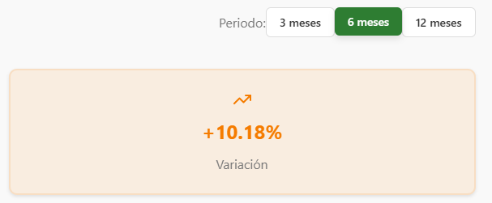 
  - "Ajo" with 6 months selected (green button), shows +10.18% variation
  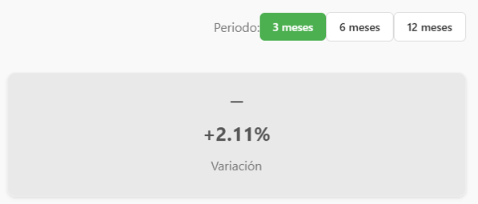 
  - "Ajo" with 3 months selected (green button), shows +2.11% variation

---

### **F-01: Price Consultation - Handle No Data**

**Status**: ✅ Implemented

#### **What flow does it cover and why should it be part of the smoke test?**

This test validates the application's error handling when a product has no historical price data. It's critical because:
- **Prevents application crashes** when data is unavailable
- Provides clear user feedback instead of technical errors
- Maintains professional UX even in edge cases
- Validates graceful degradation of the service
- Ensures users can recover and try another search
- Tests robustness of the system with incomplete data

#### **How is it executed?**

**Manual Execution**:
1. Navigate to price consultation page
2. Enter a product name that has no data (e.g., "Ajito" - a non-existent product)
3. Click "Buscar precios" button
4. Verify error page displays with clear message
5. Test "Intentar nuevamente" (Try again) button functionality
6. Verify "Volver" (Back) button returns to search page

#### **What type of test covers it?**

**Integration Test** - Because it involves:
- API call that returns 404 or empty data (`GET /api/prices/product/{name}`)
- Error response handling in the frontend
- Conditional rendering of error page vs results page
- Navigation buttons functionality
- Error state management
- User-friendly error message display

**Precondition**: 
- User is on the price consultation page
- A product with no price history exists in the system or an invalid product is searched

**Steps**:
1. Navigate to price consultation page
2. Enter a product name that has no historical data (e.g., "Ajito")
3. Optionally apply market filter
4. Click "Buscar precios" button
5. Wait for the system response

**Expected Result**:
- ❌ Clear error page displays with title "Error al cargar datos" (Error loading data)
- Error icon (⚠️ or ℹ️) is visible at the top of the error message
- Specific error message shows: "Error 404: No se encontraron datos históricos para '[Product Name]' en los últimos 12 meses."
  - Example: "Error 404: No se encontraron datos históricos para 'Ajito' en los últimos 12 meses."
- A green button labeled "Intentar nuevamente" (Try again) is prominently displayed
- "Volver" (Back) button remains available for navigation
- No broken charts or undefined values are displayed
- Page layout remains intact and professional
- Application remains stable and functional
- Console shows no critical errors
- User can click "Intentar nuevamente" to retry the search
- User can click "Volver" to return to the search page

**Reference Images**:
  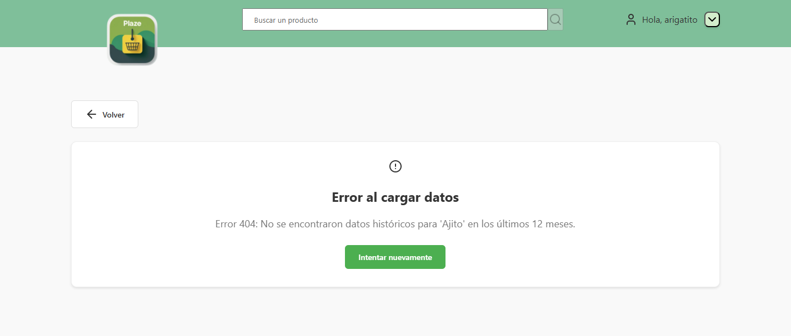 
  - Shows error page for "Ajito" with 404 message and "Intentar nuevamente" button

---

### **F-06: User Login - Incomplete Email Validation**

**Status**: ✅ Implemented

#### **What flow does it cover and why should it be part of the smoke test?**

This test validates client-side email validation for incomplete email addresses. It's critical because:
- **Prevents unnecessary API calls** with invalid data
- Improves user experience with immediate feedback
- Reduces backend load by catching errors early
- Validates form validation logic is working
- Ensures users can't proceed with malformed emails

#### **How is it executed?**

**Manual Execution**:
1. Navigate to login page
2. Enter incomplete email (e.g., "arigato@")
3. Enter any password
4. Click "Iniciar Sesión" button
5. Verify error message displays without backend call

#### **What type of test covers it?**

**Unit Test** - Because it validates:
- Client-side form validation logic
- Email regex pattern matching
- Error message rendering
- Field border styling changes
- No API interaction required

**Precondition**: User is on the login screen

**Steps**:
1. Enter incomplete email: `arigato@`
2. Enter a valid password
3. Click "Iniciar Sesión" (Log In) button

**Expected Result**:
- ❌ Error message displays: "Por favor ingresa un correo electrónico válido" (Please enter a valid email address)
- Email field border shows in red
- No backend call is made
- Button remains enabled for retry

**Reference Image**: 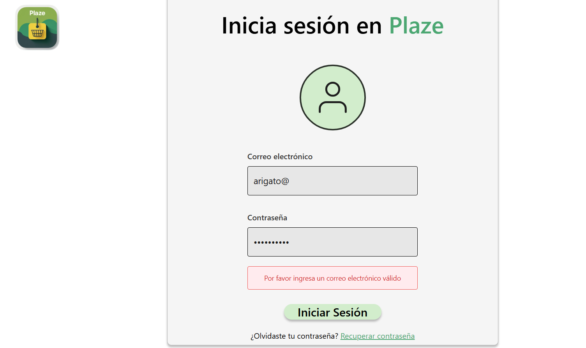

---

### **F-06: User Login - Invalid Email Validation**

**Status**: ✅ Implemented

#### **What flow does it cover and why should it be part of the smoke test?**

This test validates that emails with invalid or non-existent domains are caught before reaching the backend. It's critical because:
- **Reduces failed authentication attempts** on the backend
- Provides better UX by catching obvious errors client-side
- Validates email domain format checking
- Ensures proper error messaging for different validation scenarios

#### **How is it executed?**

**Manual Execution**:
1. Navigate to login page
2. Enter email with invalid domain (e.g., "arigato@gmail.co" - missing 'm')
3. Enter any password
4. Click "Iniciar Sesión" button
5. Verify appropriate error message displays

#### **What type of test covers it?**

**Unit Test** - Because it validates:
- Email format validation with domain checking
- Client-side validation rules
- Error message display logic
- Visual feedback (red border)
- No backend API call needed

**Precondition**: User is on the login screen

**Steps**:
1. Enter email with non-existent domain: `arigato@gmail.co`
2. Enter a valid password
3. Click "Iniciar Sesión" button

**Expected Result**:
- ❌ Error message displays: "Correo o contraseña incorrectos" (Incorrect email or password)
- Email field border shows in red
- No backend call is made
- Button remains enabled for retry

**Reference Image**: 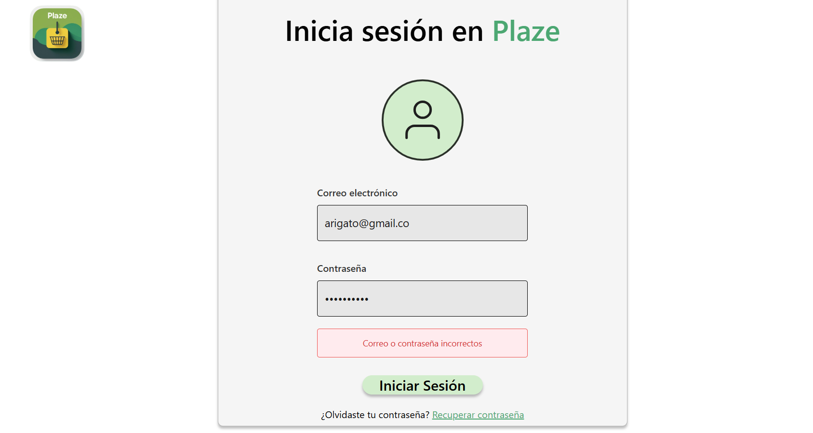

---

### **F-06: User Login - Incorrect Credentials**

**Status**: ✅ Implemented

#### **What flow does it cover and why should it be part of the smoke test?**

This test validates the authentication error flow when valid credentials don't match backend records. It's critical because:
- **Tests the complete authentication failure path** from frontend to backend
- Validates proper error message display from API responses
- Ensures fields remain filled for easy correction
- Tests security messaging (doesn't reveal if email or password is wrong)
- Validates password recovery link remains accessible

#### **How is it executed?**

**Manual Execution**:
1. Navigate to login page
2. Enter valid registered email (e.g., "arigato@gmail.com")
3. Enter incorrect password
4. Click "Iniciar Sesión" button
5. Verify error handling and field states

#### **What type of test covers it?**

**Integration Test** - Because it involves:
- Form submission with valid format but incorrect data
- API call to backend (`POST /api/auth/login`)
- Backend authentication validation
- HTTP 401 Unauthorized response handling
- Error message mapping from API response
- UI state updates based on API response

**Precondition**: User is on the login screen

**Steps**:
1. Enter valid registered email: `arigato@hotmail.com` or `arigato@gmail.com`
2. Enter incorrect password
3. Click "Iniciar Sesión" button

**Expected Result**:
- ❌ Error message displays: "Correo o contraseña incorrectos" (Incorrect email or password)
- Both field borders show in red
- Fields maintain their values to facilitate correction
- "Recuperar contraseña" (Recover password) link remains visible

**Reference Images**: 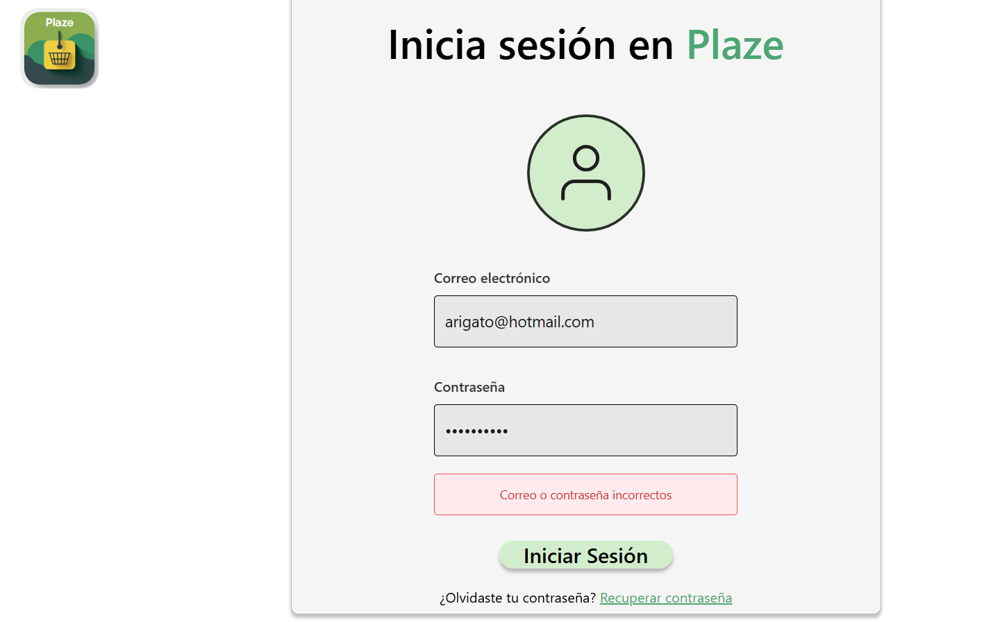

---

### **F-06: User Login - Empty Fields Validation**

**Status**: ✅ Implemented

#### **What flow does it cover and why should it be part of the smoke test?**

This test validates that the form prevents submission when required fields are empty. It's critical because:
- **Ensures data completeness** before any processing
- Prevents unnecessary backend calls with missing data
- Provides clear feedback about required fields
- Validates form validation triggers on submit
- Tests accessibility features (focus management)

#### **How is it executed?**

**Manual Execution**:
1. Navigate to login page
2. Leave both email and password fields empty (or with only spaces)
3. Click "Iniciar Sesión" button
4. Verify validation error displays
5. Check that focus moves to first empty field

#### **What type of test covers it?**

**Unit Test** - Because it validates:
- Client-side required field validation
- Form submission prevention
- Error message rendering
- Field highlighting (visual feedback)
- Focus management
- No API call involved

**Precondition**: User is on the login screen

**Steps**:
1. Leave email field empty or with only spaces
2. Leave password field empty
3. Click "Iniciar Sesión" button

**Expected Result**:
- ❌ Error message displays: "Por favor completa todos los campos" (Please complete all fields)
- Both fields are highlighted indicating they are required
- No backend call is made
- Focus is placed on the first empty field

**Reference Images**: 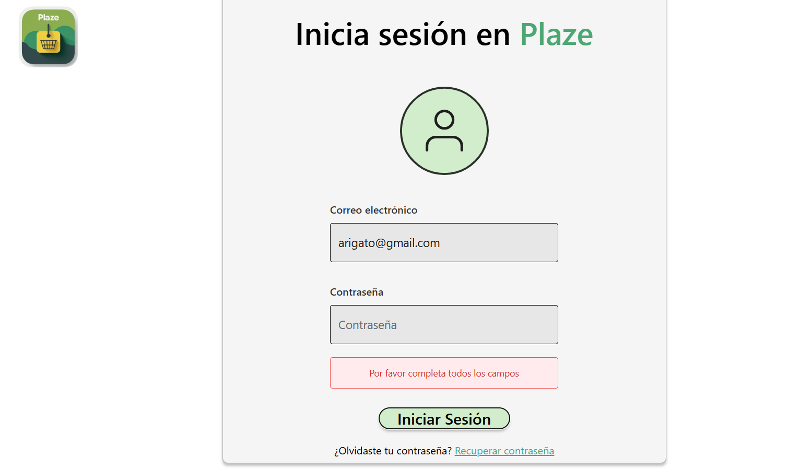 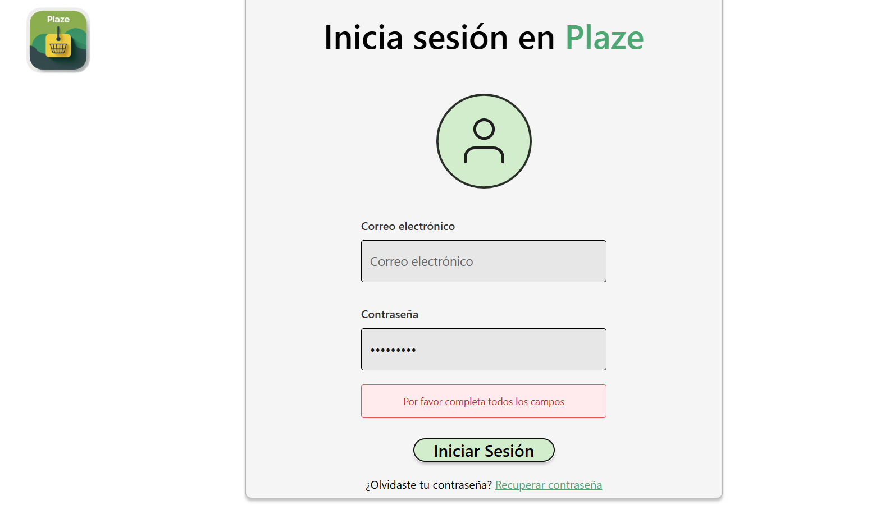

---

### **F-06: User Login - Successful Login**

**Status**: ✅ Implemented

#### **What flow does it cover and why should it be part of the smoke test?**

This test validates the complete successful authentication flow. It's critical because:
- **Tests the main happy path** of the authentication system
- Validates end-to-end authentication from frontend to backend
- Ensures token storage and session management work correctly
- Tests navigation after successful login
- Validates user context is established correctly
- Without this working, no authenticated features are accessible

#### **How is it executed?**

**Manual Execution**:
1. Navigate to login page
2. Enter valid credentials (email: "arigato@gmail.com", correct password)
3. Click "Iniciar Sesión" button
4. Verify successful authentication and redirect
5. Check user greeting appears in navigation

#### **What type of test covers it?**

**Integration Test** (required) + **E2E Test** (recommended)

**Integration** because it involves:
- Form submission with valid credentials
- API call to backend (`POST /api/auth/login`)
- Successful authentication response (HTTP 200)
- JWT token receipt and storage (localStorage/sessionStorage)
- User data extraction from response
- Navigation/redirect logic
- Authentication context update

**E2E** to validate the complete user journey including UI state after login

**Precondition**: 
- User is on the login screen
- User has valid credentials registered in the system

**Steps**:
1. Enter valid registered email: `arigato@gmail.com`
2. Enter correct password
3. Click "Iniciar Sesión" button

**Expected Result**:
- ✅ User is authenticated successfully
- Authentication token is received and stored
- Redirect to main application screen (price consultation page)
- User sees personalized greeting "Hola, arigatito" in top navigation
- No error messages are displayed
- Session remains active according to token expiration time

**Reference Images**: 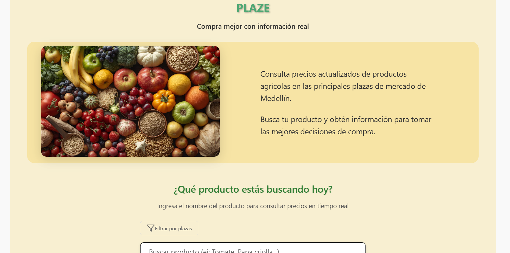

---

## 📋 Manual Testing Checklist

Before each release, manually verify:

### Price Consultation (F-01)
- [ ] **F-01**: Search input accepts product names correctly
- [ ] **F-01**: "Filtrar por plazas" button opens market filter dropdown
- [ ] **F-01**: Market selection updates filter indicator
- [ ] **F-01**: "Buscar precios" executes search with applied filters
- [ ] **F-01**: Price details page displays all 4 information cards correctly
- [ ] **F-01**: Historical price chart renders with proper data points
- [ ] **F-01**: Period buttons (3, 6, 12 months) are visible and functional
- [ ] **F-01**: Clicking period buttons updates chart and statistics
- [ ] **F-01**: Variation percentage recalculates for each period
- [ ] **F-01**: Trend indicator updates appropriately (Aumento/Estabilidad)
- [ ] **F-01**: "Volver" button navigates back to search page
- [ ] **F-01**: Error 404 page displays for products with no data
- [ ] **F-01**: "Intentar nuevamente" button allows retry after error
- [ ] **F-01**: Market filter indicator shows correctly on results page

### Login (F-06)
- [ ] **F-06**: Incomplete email shows appropriate error
- [ ] **F-06**: Invalid email shows error message
- [ ] **F-06**: Incorrect credentials show clear message
- [ ] **F-06**: Empty fields prevent form submission
- [ ] **F-06**: Successful login redirects to main page
- [ ] **F-06**: User greeting displays after successful login
- [ ] Accessibility: keyboard navigation works
- [ ] Accessibility: screen readers identify fields correctly

### Responsiveness
- [ ] Works on mobile (320px - 480px)
- [ ] Works on tablet (768px - 1024px)
- [ ] Works on desktop (1280px+)
- [ ] Search input is accessible on all screen sizes
- [ ] Market filter dropdown is usable on mobile
- [ ] Price cards stack properly on mobile
- [ ] Chart is readable and interactive on all devices

---

## 💡 Notes

* Smoke tests currently cover **the complete authentication flow** (F-06) and **complete price consultation flow** (F-01).
* **10 critical test cases** were identified and **all are implemented and working** ✅
* **F-01** includes 5 test cases covering the full price consultation workflow from search to results display
* **F-06** includes 5 test cases covering the complete authentication process
* All error messages are **clear and in Spanish**, oriented to the end user
* The design follows **modern UX/UI principles** with immediate visual feedback
* Market filtering (F-26) is integrated into F-01 test cases
* Each deployment must run these tests to confirm that core functionality remains operational
* Reference images from actual implementation are provided for visual verification