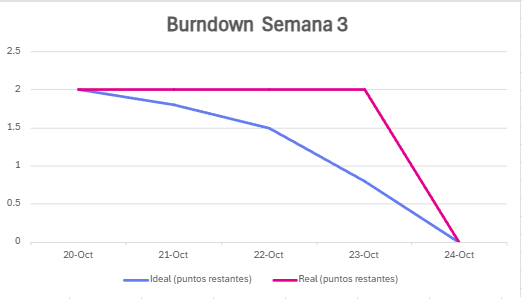
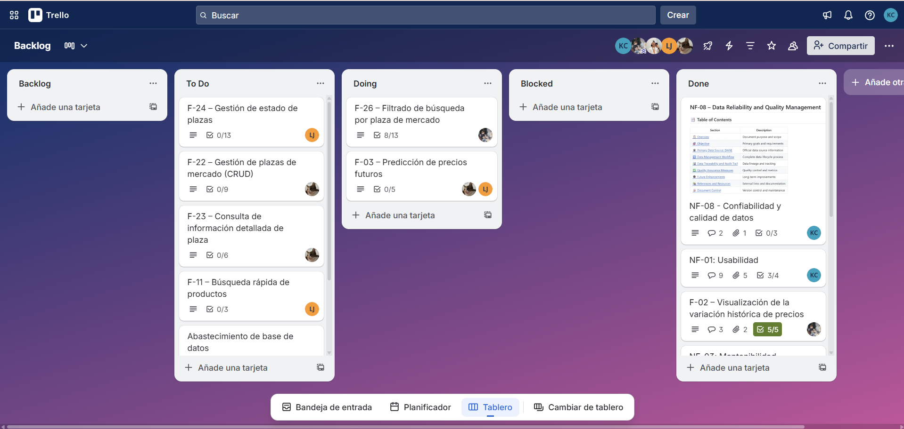
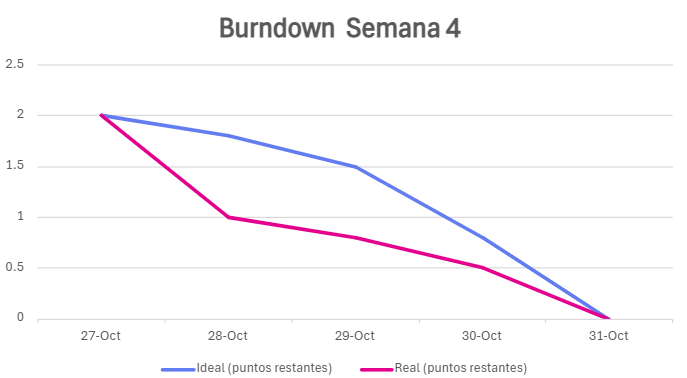
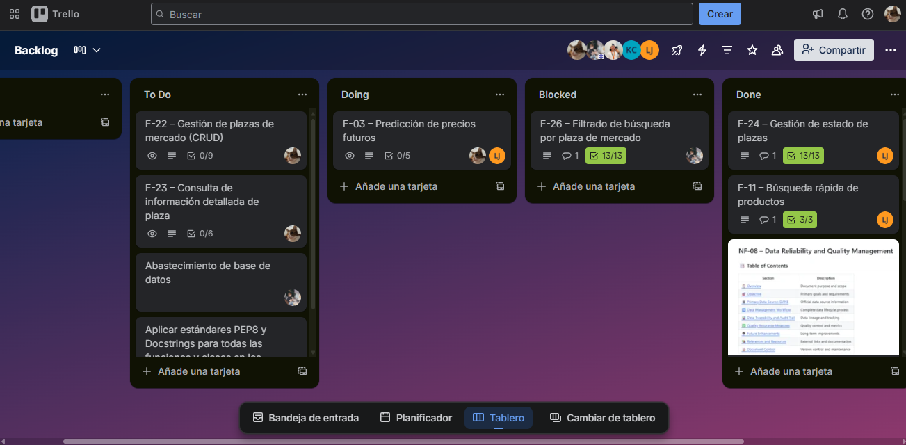
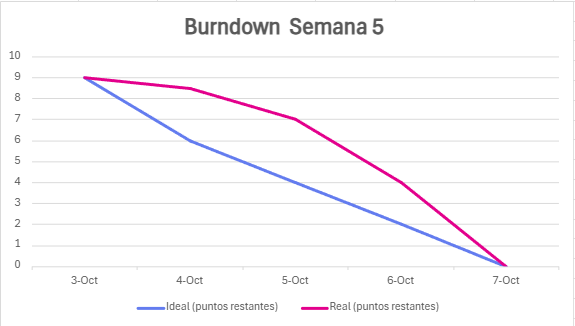
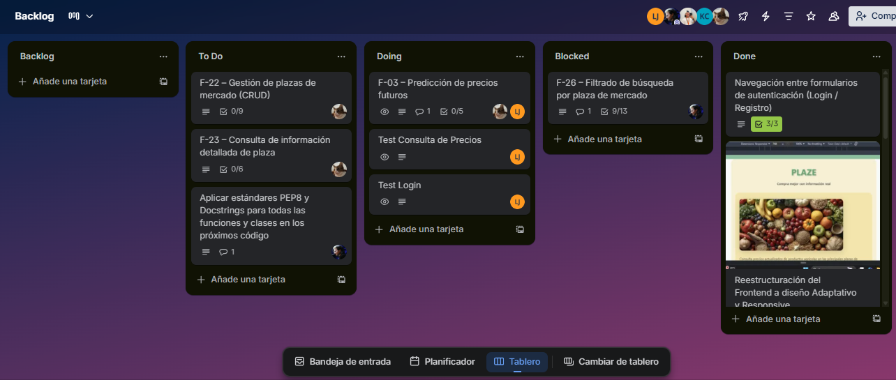

# ⏩ Avances sprints

## 🎃 Viernes 3 octubre

> ### Diagrama burndown

> ### Estado del tablero

## 🎃 Viernes 10 octubre

> ### Diagrama burndown

> ### Estado del tablero

## 🎃 Viernes 24 octubre

> ### Diagrama burndown

> ### Estado del tablero

## 🎃 Viernes 31 octubre

> ### Diagrama burndown

> ### Estado del tablero

##  🎅 Viernes 7 noviembre

> ### Diagrama burndown

> ### Estado del tablero
